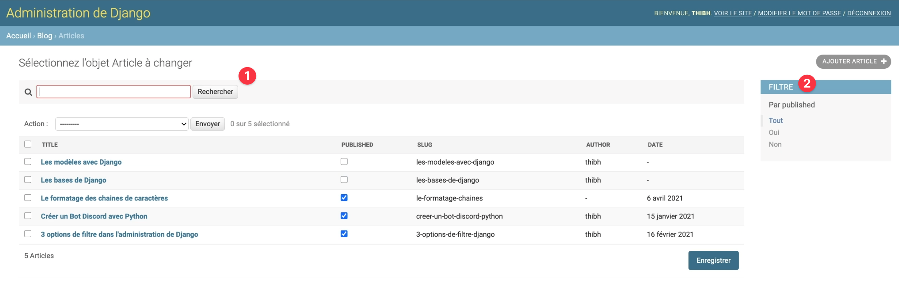

# L'interface d'administration

## Afficher un modèle

Pour afficher un modèle dans l'interface d'administration, vous avez deux options.

#### La plus simple

Utilisez la fonction `admin.site.register` :
```python
# admin.py
from django.contrib import admin
from blog.models import BlogPost

admin.site.register(BlogPost)
```

Cette fonction permet d'indiquer à Django que ce modèle doit être présent dans l'interface d'administration.

#### La plus avancée

Pour indiquer un peu plus d'options pour l'affichage et l'édition des modèles, on peut créer une classe qui hérite de `admin.ModelAdmin` et utiliser le décorateur `admin.register` :
```python
from django.contrib import admin
from blog.models import BlogPost


@admin.register(BlogPost)
class BlogPostAdmin(admin.ModelAdmin):
    pass
```
En l'état, ça ne change absolument rien à la première façon de faire, car nous n'avons rien indiqué à l'intérieur de la classe.

## Indiquer les champs à afficher

Pour indiquer quels champs afficher sur la page d'accueil d'un modèle dans l'interface d'administration, on utilise l'attribut de classe `list_display` :
```python
from django.contrib import admin
from blog.models import BlogPost


@admin.register(BlogPost)
class BlogPostAdmin(admin.ModelAdmin):
    list_display = ("title", "published", "date")
```

> On peut utiliser une liste ou un tuple, cela n'a pas d'importance. Généralement on utilise un tuple car on sait que cette liste de champs n'a pas vocation à être modifiée après sa création.

## Indiquer les champs éditable

Pour indiquer des champs que l'on souhaite pouvoir éditer directement depuis la page d'accueil d'un modèle, on utilise l'attribut `list_editable` :
```python
from django.contrib import admin
from blog.models import BlogPost


@admin.register(BlogPost)
class BlogPostAdmin(admin.ModelAdmin):
    list_display = ("title", "published", "date")
    list_editable = ("published", )
```

> Les champs dans `list_editable` doivent être également présents dans `list_display` (et c'est logique car pour pouvoir les éditer il faut bien qu'ils soient déjà affichés).

Si vous indiquez dans `list_editable` le premier champ de `list_display`, ce champ ne pourra plus être utilisé pour accéder à la page d'une entrée de votre base de données. Il vous faudra donc spécifier d'autres champs dans l'attribut `list_display_links` qui pourront être utilisés comme liens pour accéder à la page :
```python
from django.contrib import admin
from blog.models import BlogPost


@admin.register(BlogPost)
class BlogPostAdmin(admin.ModelAdmin):
    list_display = ("title", "published", "date")
    list_editable = ("title", )  # On rend éditable le premier champ affiché
    list_display_links = ("date", )  # On indique qu'on peut cliquer sur la date pour accéder à l'article
```

## Accéder à une page sur le site

Pour afficher le bouton `Voir sur le site` dans la page d'édition d'une instance d'un modèle, on doit créer une méthode `get_absolute_url` (le nom ici est important !) dans le modèle :
```python
from django.db import models
from django.urls import reverse


class BlogPost(models.Model):
    [...]

    def get_absolute_url(self):
        return reverse("blog-post", kwargs={"slug": self.slug}) 
```

Ici, on utilise la fonction `reverse` pour récupérer l'URL de l'article de façon dynamique en fonction de son slug.

## Filtrer les instances

Pour rajouter des options de filtres basiques sur les pages d'administration, on peut utiliser les attributs `search_fields` (pour faire une recherche textuelle sur un champ) et `list_filter` (pour filtrer sur la valeur des chamos définis) :

```python
from django.contrib import admin
from blog.models import BlogPost


@admin.register(BlogPost)
class BlogPostAdmin(admin.ModelAdmin):
    list_display = ("title", "published", "date")
    search_fields = ("title", "slug", )
    list_filter = ("published", )
```

Avec ces deux attributs, vous pourrez chercher dans les instances d'un modèle avec une boîte de texte (1) et avec des options de filtres (2) :



## Limiter le nombre d'instances

Par défaut, les 100 premières instances de votre base de données sont affichées. Au-delà de ce nombre, un système de pagination vous permettra d'accéder aux entrées suivantes.

Pour afficher plus ou moins d'instances, vous pouvez utiliser l'attribut `list_per_page` :

```python
from django.contrib import admin
from blog.models import BlogPost


@admin.register(BlogPost)
class BlogPostAdmin(admin.ModelAdmin):
    list_display = ("title", "published", "date")
    list_per_page = 25  # On affiche 25 instances par page
```